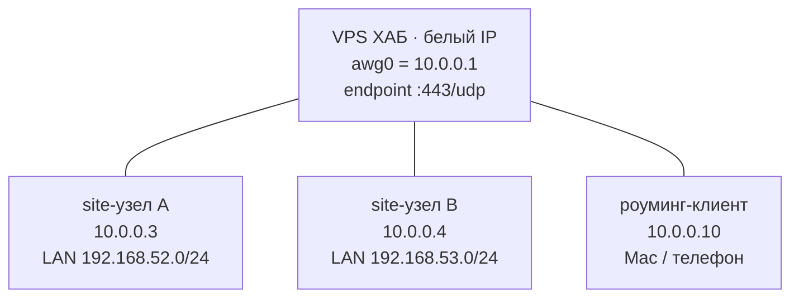

# 00 · Обзор

Меш-сеть на **AmneziaWG** с центральным хабом на VPS. Узлы (роутеры на разных площадках) и роуминг-клиенты подключаются к хабу и видят LAN-подсети друг друга через один зашифрованный, DPI-устойчивый туннель.

## Топология

Все линии — туннель **AmneziaWG** с единым профилем обфускации 2.0.

## IP-план (пример)

| Узел | WG-адрес | LAN-подсеть | Роль |
|---|---|---|---|
| VPS хаб | `10.0.0.1` | — | центр, маршрутизация |
| site A | `10.0.0.3` | `192.168.52.0/24` | роутер площадки |
| site B | `10.0.0.4` | `192.168.53.0/24` | роутер площадки |
| клиент | `10.0.0.10` | — | ноут/телефон |

- WG-сеть: `10.0.0.0/24` (хаб `.1`, site-узлы `.2–.9`, клиенты `.10+`).
- `AllowedIPs` — **только internal** (WG-сеть + LAN-подсети), без `0.0.0.0/0`: меш связывает частные сети, а не гонит весь интернет через VPS.

## Принципы

- **Единый профиль обфускации** AWG 2.0 — байт-в-байт на всех участниках.
- **Порт `443/udp`** — маскировка под QUIC.
- **Маршруты на LAN-подсети** живут в `PostUp` хаба (`syncconf` их не создаёт).
- **Обход локальных перехватчиков** (Clash/podkop) — на стороне узлов, не на хабе.
- **Секреты не в гите** — приватные ключи и `.peer`/`hub.env` исключены в `.gitignore`.

## Порядок работ

1. [01 · Подготовка сервера](01-server-prep.md) — укрепление ОС.
2. [02 · AmneziaWG на сервере](02-server-awg.md) — хаб.
3. [03 · Подготовка роутера](03-router-prep.md) — site-узлы _(следующий шаг)_.
